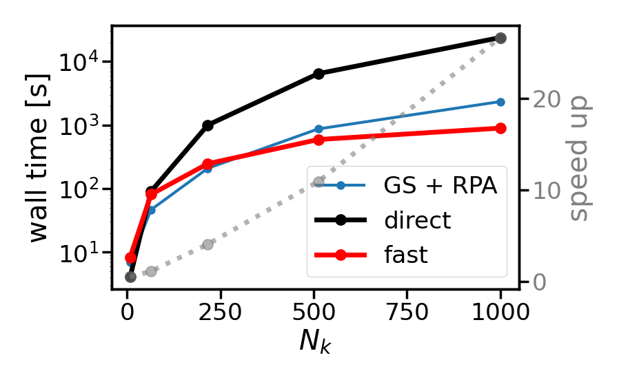
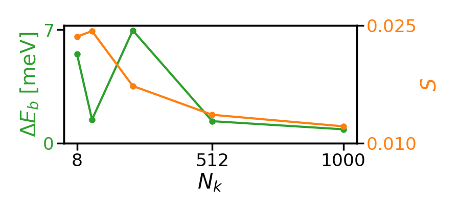

# Summary

Solving the Bethe-Salpeter Equation (BSE) is essential for understanding excited-state systems, but often challenging to converge or even computationally prohibitive for large systems. We implement a matrix-free BSE solver leveraging Interpolative Separable Density Fitting (ISDF) to interpolate electron-hole interaction kernels together with the Lanczos algorithm for diagonalization, avoiding full matrix setup. The scaling of our implementation is bounded by $\mathcal{O}(N_o N_u N_{\mathbf k} \log N_{\mathbf k})$ and  is thus a massive improvement over methods that set up the whole matrix, scaling with at least $\mathcal{O}((N_o N_u N_{\mathbf k})^3)$, where $N_o$ and $N_u$ are the numbers of occupied and unoccupied states, respectively, and $N_{\mathbf k}$ is the number $\mathbf{k}$-points.

# Theoretical background

The  Bethe-Salpeter Equation (BSE) within many body perturbation theory (MBPT) provides the state-of-the-art frame work for describing light-matter interaction. In particular, it is used to obtain optical absorption spectra, including the effects of excitons, which are bound electron-hole states. By expanding the electron-hole wavefunctions in the transition basis, solving the BSE can be reduced to a Schr\"odinger like equation. Setting up and diagonalizing the Bethe-Salpeter Hamiltonian (BSH) are the computationally expensive tasks[@Vorwerk:2019]. The BSH is given as
$$
H^{BSH} = D + \gamma V - W \:,
$$
where $\gamma = 2$ gives the spin-singlet and $\gamma = 0$ spin-triplet channel, respectively. The diagonal term $D$ is given by the differences of the one-particle energies of the occupied ($o$) and unoccupied ($u$) states:
$$
D_{ou\mathbf{k},o'u'\mathbf{k}'} = (\varepsilon_{u\mathbf{k}} - \varepsilon_{o\mathbf{k}})\delta_{oo'}\delta_{uu'}\delta_{\mathbf{k}\mathbf{k}'}\:.
$$
The matrix elements of the repulsive exchange interaction $V$ and the attractive screened Coulomb interaction $W$ are calculated by solving integrals of the form
$$
V_{ou\mathbf{k}, o'u'\mathbf{k}'} = \int d^3r \int d^3 r' \frac{ 
u_{o\mathbf{k}}(\mathbf{r})
u^*_{u\mathbf{k}}(\mathbf{r})
u^*_{o'\mathbf{k}'}(\mathbf{r'})
u_{u'\mathbf{k}'}(\mathbf{r'}) 
} {| \mathbf{r - r'} |} \:,
$$
$$
W_{ou\mathbf{k}, o'u'\mathbf{k}'} = \int d^3r \int d^3 r' u^*_{u\mathbf{k}}(\mathbf{r})
u_{u'\mathbf{k}'}(\mathbf{r}) 
W_{\mathbf{k-k'}} (\mathbf{r, r'})
u_{o\mathbf{k}}(\mathbf{r}')
u^*_{o'\mathbf{k}'}(\mathbf{r}')
 \:,
$$
where $W_{\mathbf{k-k'}}(\mathbf{r}, \mathbf{r}')$ is the statically screened Coulomb potential. $u_{i\mathbf{k}}(\mathbf{r})$ is the periodic part of the one-particle wavefunction of state $i$ at the reciprocal lattice point $\mathbf{k}$. In general, we cannot see, which of the matrix elements will be zero, thus we need to compute all of them. Therefore, setting up the full BSH scales with $\mathcal{O}(N_o^2 N_u^2 N_{\mathbf{k}}^2)$ and diagonalizing it directly with $\mathcal{O}(N_o^3 N_u^3 N_{\mathbf{k}}^3)$. 
	
The primary scaling bottleneck stems from evaluating the matrix elements of the interaction kernels. To mitigate this, we reformulate the wavefunction products using Interpolative Separable Density Fitting (ISDF) [@Lu:2015]. Specifically, we approximate these products on a discrete real-space grid, $\{\mathbf{r}\}$, by expressing them as superpositions of values evaluated on a smaller interpolation grid, $\{\mathbf{r}_\mu\} \subset \{\mathbf{r}\}$:
$$
u_{i\mathbf{k}}^*(\mathbf{r})u_{j\mathbf{k}'}(\mathbf{r}) \approx \sum_{\mu=1}^{N_\mu} \zeta_\mu(\mathbf{r}) u_{i\mathbf{k}}^*(\mathbf{r}_\mu) u_{j\mathbf{k}}(\mathbf{r}_\mu) \:,
$$
where $N_\mu$ is the number of interpolation points, and $\zeta_\mu(\mathbf r)$ are the expansion coefficients. Due to the tensor product structure of $u_{i\mathbf{k}}^*(\mathbf{r})u_{j\mathbf{k}'}(\mathbf{r})$, $\zeta_\mu(\mathbf r)$ can be computed efficiently, and the scaling is bounded by $\mathcal{O}(N_\mu^3)$ [@Hu:2017]. We observe that we can always choose $N_\mu \ll N_o N_u N_\mathbf{k}$, thus ISDF is never a bottleneck. The interpolation points are computed efficiently with centroidal Voronoi tessellation within $\mathcal{O}(N_\mu N_r)$ [@Dong:2018].

Inserting ISDF in the equations for the interaction kernels yields
$$
V_{ou\mathbf{k}, o'u'\mathbf{k}'} \approx \frac{1}{N_k^2} \sum_{\mu=1}^{N_\mu^V} \sum_{\nu=1}^{N_\mu^V}
u_{o\mathbf{k}}(\mathbf{r}_\mu^V) 
u^*_{u\mathbf{k}} (\mathbf{r}_\mu^V)
\tilde V_{\mu \nu}
u^*_{o'\mathbf{k}'} (\mathbf{r}_\nu^V) 
u_{u'\mathbf{k}'} (\mathbf{r}_\nu^V),
$$
$$
W_{ou\mathbf{k}, o'u'\mathbf{k}'} \approx \frac{1}{N_k^2} \sum_{\mu=1}^{N_{\mu}^{W_u}} \sum_{\nu=1}^{N_{\mu}^{W_o}}
u^*_{u\mathbf{k}} (\mathbf{r}_\mu^{W_u}) 
u_{u'\mathbf{k}'} (\mathbf{r}_\mu^{W_u})
\tilde W_{\mu\nu, \mathbf{k-k'}}
u_{o\mathbf{k}}(\mathbf{r}_\nu^{W_o})
u^*_{o'\mathbf{k}'} (\mathbf{r}_\nu^{W_o}) 
\:,
$$
where we have shifted the integration from the wavefunction pairs to the interpolation coefficients such that
$$
\tilde V_{\mu \nu} = \int_{\Omega^l\times \Omega^l}drdr' \zeta_\mu^{*V}(\mathbf{r}) V(\mathbf{r},\mathbf{r'}) \zeta_\nu^{V}(\mathbf{r'}) \:,
$$
$$
\tilde W_{\mu\nu, \mathbf{k-k'}} = \int_{\Omega^l\times \Omega^l}drdr' \zeta_\mu^{*W_u}(\mathbf{r}) W_{\mathbf{k}-\mathbf{k'}}(\mathbf{r},\mathbf{r'}) \zeta_\nu^{W_o}(\mathbf{r'}) \:.
$$
Note that there are three different wavefunction pairings, i.e. $u_{o\mathbf{k}}^*(\mathbf{r})u_{u\mathbf{k}}(\mathbf{r})$ for the exchange kernel ($V$) and $u_{o\mathbf{k}}^*(\mathbf{r})u_{o'\mathbf{k}'}(\mathbf{r})$, $u_{u\mathbf{k}}^*(\mathbf{r})u_{u'\mathbf{k}'}(\mathbf{r})$ for the screened kernel $W$. Each pairing requires a separate ISDF calculation, denoted by the superscripts $V$, $W_o$, and $W_u$. Since the number of combinations may vary, the number of interpolation points required may also vary. Reformulating the matrix elements in this way alone does not improve scaling with respect to the system size. To achieve this, we combine it with an iterative solver, here with the Lanczos algorithm. This class of algorithms constructs an approximation to the eigenvalues and eigenvectors by iteratively applying matrix-vector multiplications. Applying the interaction kernels in their interpolated forms to a vector $X$ of dimension $N_o N_u N_\mathbf{k}$ allows efficient computation by rearranging the summations to exploit a separable structure of the kernels. For the exchange kernel we get
$$
[V \cdot X]_{ou\mathbf k} = \frac{1} {N_\mathbf k} \sum_{\mu=1}^{N_\mu^V}
u^*_{u\mathbf k}(\mathbf{r}_\mu^V)  
u_{o\mathbf k}(\mathbf{r}_\mu^V) 
\left\{\sum_{\nu=1}^{N_\mu^V} \tilde V_{\mu\nu} \left[ \sum_{\mathbf k'}
\left(\sum_{u'} 
u_{u'\mathbf k'}(\mathbf{r}_\nu^V) 
\left[\sum_{o'} 
u^*_{o'\mathbf k'}(\mathbf{r}_\nu^V) 
\cdot X_{ o' u' \mathbf k'}
\right]\right)\right]\right\} \:,
$$
where we first compute the sums over $o'$, $u'$, and $\mathbf{k}'$ to get a term that depends only on $\mathbf{r}_\nu^V$ with a complexity of $\mathcal{O}(N_\mu^V(N_o N_u N_{\bf k} + N_uN_{\bf k})$. The remaining sums can be computed with $\mathcal{O}((N_\mu^V)^2 N_\mu^V N_o N_u N_{\bf k})$, so the complexity of computing $V\cdot X$ is bounded by $\mathbf{O}((N_\mu^V)^2 + N_\mu N_o N_u N_{\bf k})$.
Applying the screened kernel to $X$, after reordering the sums, we get
$$
\begin{aligned}
[W \cdot X]_{ou\mathbf k} = \frac{1} {N_k} \sum_{\nu=1}^{N_\mu^{W_o}}
u_{o\mathbf k}(\mathbf r_\nu^{W_o}) \left\{ \sum_{\mu=1}^{N_\mu^{W_u}}
u^*_{u\mathbf k}(\mathbf r_\mu^{W_u})
\left[
\sum_{\mathbf{k'}}
\tilde{W}_{\mu\nu, \mathbf{k-k'}}
\left(\sum_{u'}
u_{u'\mathbf k'}(\mathbf r_\mu^{W_u})
\left[\sum_{o'} \\
u^*_{o'\mathbf{k'}}(\mathbf{r}_\nu^{W_o}) 
X_{ o' u' \mathbf{k'}}
\right]\right)\right]\right\} \:.
\end{aligned}
$$
Here we exploit the separable structure of the decomposition so that the terms depending on ${\bf k}$ and ${\bf k'}$ are on the left and right of $\tilde{W}_{\mu\nu, \mathbf{k-k'}}$. The evaluation of the two innermost sums over $o'$ and $u'$ to $A^{\bf k'}_{\mu\nu}$ scales with $\mathcal{O}(N^{W_u}_\mu N_o N_u N_\mathbf{k} + N^{W_o}_\mu N_\mu^{W_u} N_u N_\mathbf{k})$. Then the sum over ${\bf k'}$ reads as a discrete convolution
$$
\sum_{\mathbf{k}'}W_{\mathbf{k}-\mathbf{k}'} A^{\bf k'}_{\mu\nu} \:,
$$
which can be efficiently evaluated with fast Fourier transforms simultaneously within the $\mathcal{O}(N{\bf k} \log N{\bf k})$ scaling for each $\mu\nu$ pair. The remaining summations scale with $\mathcal{O}(N^{W_o}_\mu N_\mu^{W_u} N_u N_\mathbf{k})$. So the complexity for the computation of $W\cdot X$ is bounded by $\mathcal{O}( N^{W_u}_\mu N_o N_u N_\mathbf{k} + N^{W_o}_\mu N_\mu^{W_u} N_u N_\mathbf{k} + N^{W_o}_\mu N_\mu^{W_u} N_\mathbf{k} \log N_\mathbf{k})$.

# Statement of need

Due to the unfavorable scaling of solving the BSE directly, many interesting problems such as complex materials with large unit cells or systems requiring a dense Brioullin-zone sampling are not feasible. Even though Henneke and coworkers [@Henneke:2020] have already described the new algorithm and demonstrated the scaling improvement, an easy-to-use and scalable implementation was still missing. We have implemented and fully integrated this approach in the existing BSE infrastructure of the all-electron, full-potential package exciting [@Gulans:2014]. Users can now easily choose which algorithm they prefer to use and have the full suite of exciton analysis implemented in exciting at hand.

# Results

To demonstrate that our implementation does indeed scale as proposed, we run BSE calculations for increasing $N_\mathbf{k}$ using the direct and the new implementation. In Fig.(\autoref{fig:scaling}) we show the wall times for the example of diamond. The new algorithm massively outperforms the direct, and the speed up increases more than linearly with $N_\mathbf{k}$.

In Fig.(\autoref{fig:error}) we show the differences in exciton binding energies obtained from the direct implementation, which sets up and diagonalizes the full BSH, and the new implementation with fixed numbers of interpolation points: $N_\mu^V = 202$, $N_\mu^{W_o} = 322$, and $N_\mu^{W_u} = 360$ for the ISDF. Additionally, we present the spectral similarity, defined here as the area between the two curves. Even with these fixed numbers of interpolation points, the results of the new algorithm converge to those of the direct algorithm as $N_\mathbf{k}$ increases. This demonstrates that the new implementation yields results equivalent to the direct solution of the BSE but with significantly reduced computational time. Consequently, it enables more precise calculations and facilitates the study of more complex problems.

# References