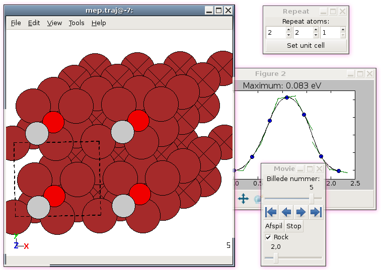

.. module:: gui
   :synopsis: Simple graphical user-interface for ASE.

.. index:: gui, ag, ase-gui

=======
ASE-GUI
=======

The graphical user-interface allows users to visualize, manipulate,
and render molecular systems and atoms objects. It also allows to
setup and run a number of calculations and can be used to transfer
between different file formats. 

.. toctree::

   basics
   edit
   view
   tools
   setup
   calculate

